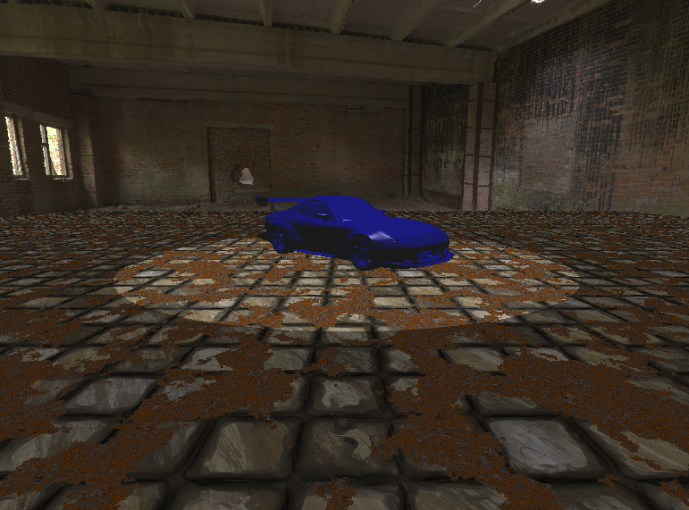

# COMP3015 CW1
This is my repository for my OpenGL program.

# OS - Visual studio - OpenGL
- The os is Widnows 11, I am using an Nvidia 40 series card with OpenGL 4.6.
- I used visual studio 2022 to write and test the code locally.

# How it works
The code works by creating a scene in main which constructs an OpenGL window though which you see the application.
It then compiles some shader programs, these require .vert and .frag shader files.
These shader files communicate with the graphics card and the code and essentially tell the computer what needs to be drawn on the screen.
The scene code sets up some variables and sends the information to the shader program.
With each shader program you can create various effects, in this instance, I had 3 shader programs.
- multiTextureSpotToon (used for the plane/ground)
- toonSpotSingleColor (used for the car)
- skyBox (used for the skybox/background)

- As you can see, the plane has a circle of light at the bottom, this shows that there is a spot light.
There are also 2 combined textures on the plane which are the tiles and the rust, this means its multitextured.

- As for the car, you can see that it is untextured but you get a good example of how blinn phong lighting affects the car.
You can also see that the shades of blue are hard not soft, this means that toon shading is in effect.

- As for the skybox, it is very simple, it just loads a set of images and consructs a cube out of them which the player sits inside making it look like the environnment.

## Controls

You can control the scene with keyboard controls:
- Down arrow - Zoom out
- Up arrow - Zoom in
- S - Toggle the car spinning

## Extra resources

There are some assets which I took from the internet which are used in this project non-commercially:
- https://sketchfab.com/3d-models/mazda-rx-7-tuned-74bf6d2d2be84bc084577a7aa5d81f68 (Mazda car model)
- https://www.turbosquid.com/3d-models/3d-nissan-skyline-r32-gtr-model-2170757  (Skyline car model)
- https://opengameart.org/textures/all - (Floor textures)
- https://hdri-skies.com/ - (sky box)

# Youtube Link

Here is the Youtube link where I explain in more detail: https://www.youtube.com/watch?v=rsXifV7Tngo 

# Github Link

Here is the GitHub link:  https://github.com/ArnasPuskunigis/comp3015  